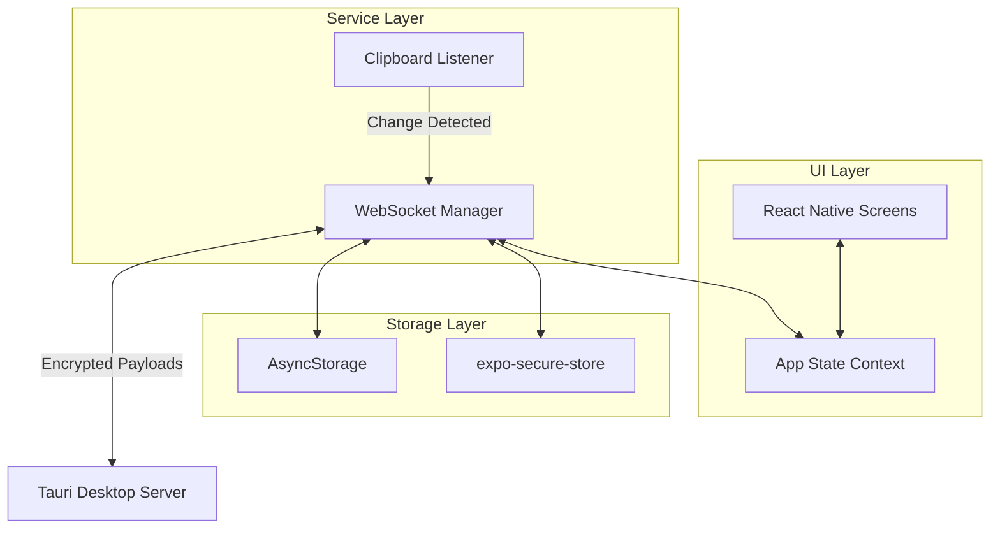
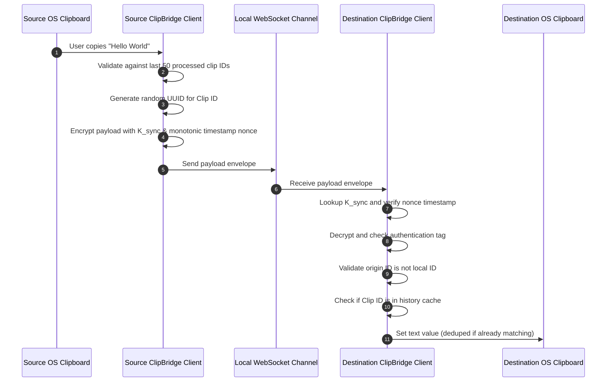

# ClipBridge Architecture Specification

This document details the architectural layout, core subsystems, data boundaries, and network topologies that govern the ClipBridge ecosystem.

---

## 🏗️ System Overview

ClipBridge employs a peer-to-peer / host-client topology operating within a Local Area Network (LAN). 

```
                                  +-----------------------+
                                  |     Local Network     |
                                  |        (Subnet)       |
                                  +-----------+-----------+
                                              |
                     +------------------------+------------------------+
                     |                                                 |
       +-------------v-------------+                     +-------------v-------------+
       |       Tauri Desktop       |                     |    React Native Mobile    |
       |          (Host)           |                     |          (Client)         |
       +-------------+-------------+                     +-------------+-------------+
       |   Axum WebSocket Server   | <=================> |  WebSocket Connection     |
       |   mDNS Responder          |  mDNS & Secure WS   |  mDNS Network Service     |
       |   OS Clipboard Listener   |                     |  OS Clipboard Service     |
       +---------------------------+                     +---------------------------+
```

- **Tauri Desktop (Host)**: Acts as the coordinating peer. It runs a background thread that monitors the desktop OS clipboard and listens for incoming pairing requests (`/pair`) and active synchronization sessions (`/ws`).
- **React Native Mobile (Client)**: Acts as the secondary peer. It uses native platform modules to track mobile clipboard changes, resolves hosts via Multicast DNS, and initiates persistent socket connections to the desktop.

---

## 📂 Subsystem Design

### 1. Desktop Architecture (Rust + Tauri + React)

The desktop application is built as a hybrid Rust/Web application using Tauri v2.

```mermaid
graph TD
    subgraph Frontend (React + TypeScript + Vite)
        UI[Liquid Glass Web UI] <--> TS[API Client / Tauri Invoker]
    end
    
    subgraph Backend (Rust Core)
        TMain[Tauri Command Router] <--> TS
        NS[Axum Web Server] <--> DB[(Pairing DB / SQLite)]
        TMain <--> DB
        
        CM[Clipboard Monitor] -->|Broadcast Event| TMain
        CM -->|Publish Broadcast| NS
    end
    
    NS <--->|WebSocket / TCP| Mobile[Android / Mobile Peer]
```

- **Tauri WebView Interface**: Rendered via WebKit/WebView2. Built using React and Vite, featuring an Apple-inspired Liquid Glass UI. Communication with the Rust backend occurs over Tauri commands (`invoke`).
- **Axum Web Server**: Runs on a separate Tokio task. It manages HTTP upgrades to WebSockets on port `54670`.
- **Clipboard Monitor Thread**: Spawns a polling or event-based listener depending on the OS (via `arboard`). It detects changes, dedupes them against recent network syncs, and broadcasts updates.

### 2. Mobile Architecture (React Native + Expo)

The mobile client is written in TypeScript and executed by the Hermes engine.



- **WebSocket Connection Manager**: Manages sockets with exponential backoff. It automatically suspends heartbeats and reconnect attempts when the app goes into the background, preserving battery.
- **Secure Keyring**: Uses `expo-secure-store` to lock the symmetric encryption keys (`K_sync`) in hardware-backed storage (TEE/Keychain).
- **Clipboard Service**: Watches the OS clipboard. When a copy occurs, it checks the local ring buffer cache of recently received network syncs to prevent loop propagation.

---

## 🛡️ Network and Cryptography Subsystem

No plaintext data is ever sent across the local network. 

```mermaid
flowchart TD
    subgraph Pairing Phase (Out-of-Band)
        DesktopID[Desktop ID] & DesktopPK[Desktop Public Key] --> QR[QR Code]
        QR -->|Scan QR| PhoneScan[Android App]
        PhoneScan -->|Generate Ephemeral Key| KeyAgreement[Diffie-Hellman Exchange]
    end
    
    subgraph Encryption System (AES-256-GCM)
        SharedSecret[X25519 Shared Secret] --> HKDF[HKDF-SHA256 Key Derivation]
        HKDF -->|Derive| KSync[Symmetric Key K_sync]
        PlaintextText[Plaintext Clipboard] & MonotonicNonce[Monotonic Nonce] --> AES[AES-256-GCM Encrypter]
        KSync --> AES
        AES -->|Encrypted Envelope| WebSocket[WebSocket Packet]
    end
```

### Key Agreement (Pairing Flow)
1. **QR Generation**: Desktop exposes device identity metadata and its X25519 public key.
2. **WebSocket Handshake**: Mobile connects to `/pair`, transmitting its own X25519 public key.
3. **ECDH Key Agreement**: Both parties compute a shared secret:
   $$\text{Secret} = X25519(SK_{client}, PK_{server})$$
4. **Key Expansion**: A 256-bit symmetric encryption key `K_sync` is derived via HKDF-SHA256:
   $$K_{sync} = \text{HKDF-Expand}(\text{HKDF-Extract}(\text{Secret}), \text{"clipbridge-sync-key"}, 32)$$

---

## 🔄 Clipboard Flow Subsystem

To sync clipboard updates without triggering endless reflection loops, the system implements local deduplication:



---

## 📂 Storage Architecture

ClipBridge storage is structured into three tiers based on secrecy and persistence requirements:

| Storage Type | Desktop (Host) Implementation | Mobile (Client) Implementation | Data Content |
| :--- | :--- | :--- | :--- |
| **Secure Keyring** | System OS Credentials (DPAPI / Keychain) | `expo-secure-store` | Derived $K_{sync}$ keys, private identity keys |
| **JSON Storage** | `pairing.json` & `history.json` | `AsyncStorage` | Paired device metadata, device names, IDs |
| **Identity File** | `device_id.txt` | `AsyncStorage` | Persistent local UUID |
