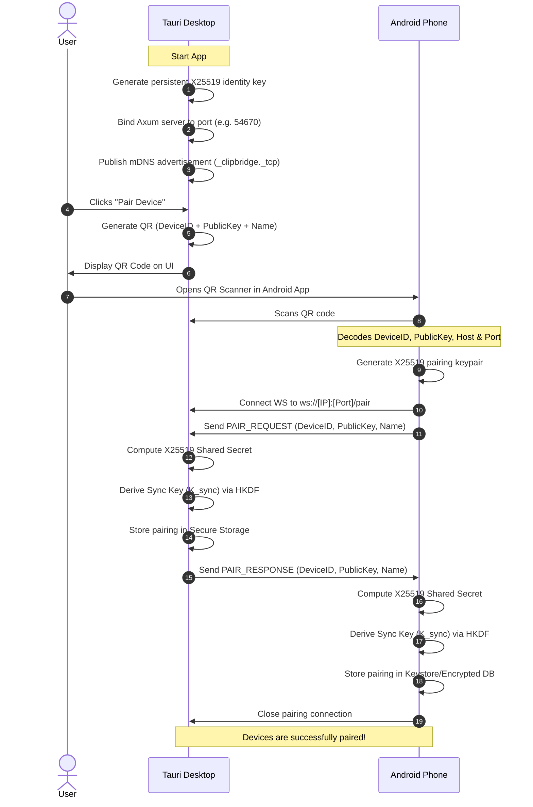
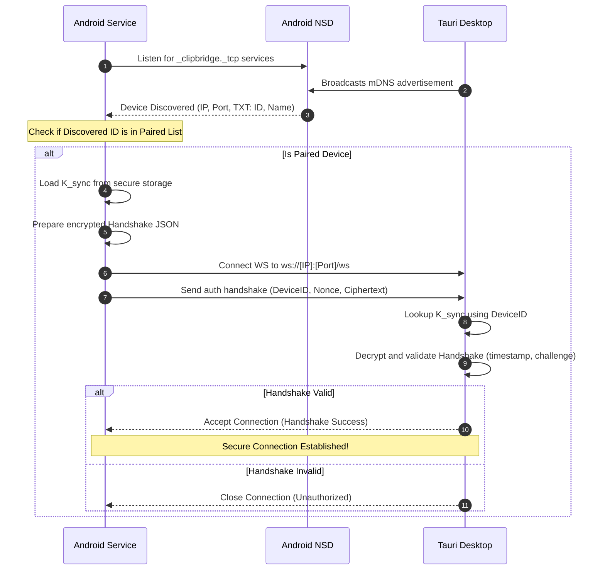
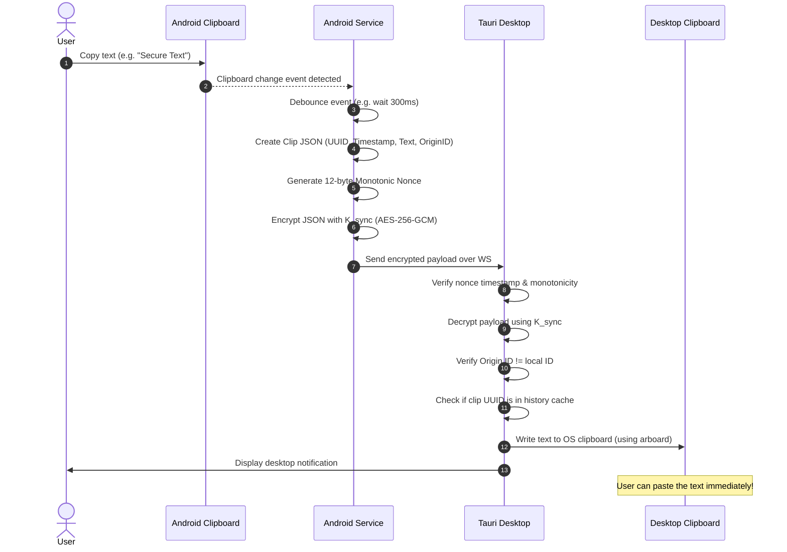

# ClipBridge Sequence Diagrams

This document illustrates the message sequences for core flows: pairing, connection establishment, and clipboard synchronization.

---

## 1. Device Discovery & Pairing Flow

This sequence shows how a Desktop client displays a QR code, which an Android device scans to negotiate keys and pair.

---

## 2. Automatic Connection & Handshake

This sequence shows how the Android Foreground Service detects a paired desktop on local Wi-Fi and connects.

---

## 3. Clipboard Synchronization Flow

This sequence shows how a copy event on Android is securely synchronized to the Desktop.

